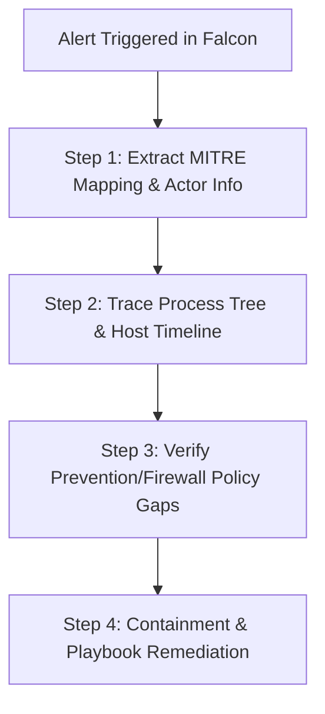

# CrowdStrike Falcon - MITRE ATT&CK Operational Standards and Workflow

## 1. Executive Summary & Framework Integration
The MITRE ATT&CK (Adversarial Tactics, Techniques, and Common Knowledge) framework serves as the baseline language for defining adversary behaviors within the Grant Thornton SOC. The CrowdStrike Falcon platform integrates this framework natively to map telemetry, detections, and threat intelligence to specific attacker methodologies. 

By aligning security alerts to MITRE ATT&CK, analysts can quickly determine:
1.  **Adversary Intent (Tactics):** What is the attacker trying to achieve? (e.g., Credential Access, Lateral Movement).
2.  **Adversary Method (Techniques/Sub-techniques):** How are they executing their objective? (e.g., LSASS Memory Dumping - T1003.001).
3.  **Adversary Attribution (Threat Actor Profiles):** Who is targeting the infrastructure? (e.g., FANCY BEAR, WICKED SPIDER).

---

## 2. Standard CrowdStrike Falcon to MITRE ATT&CK Mapping
CrowdStrike Falcon maps endpoint detections, cloud security incidents, and threat intelligence directly to the ATT&CK matrix:

| Detection Severity | MITRE Tactic Example | Common Technique Mapped | Falcon telemetry source |
|---|---|---|---|
| **Critical** | Initial Access | Spearphishing Attachment (T1566.001) | Falcon Sensor (Mail/Process) |
| **High** | Execution | Command and Scripting Interpreter (T1059) | Falcon Sensor (PowerShell/CMD) |
| **High** | Persistence | Registry Run Keys / Startup Folder (T1547.001) | Falcon Sensor (Registry Write) |
| **Critical** | Defense Evasion | Process Impersonation (T1134.004) | Falcon Sensor (Reflective DLL) |
| **Critical** | Credential Access | OS Credential Dumping: LSASS (T1003.001) | Falcon Sensor (Memory Access) |
| **High** | Lateral Movement | Remote Services: WMI/SMB (T1021.002) | Falcon Sensor (Network/Process) |
| **Medium** | Discovery | System Network Configuration Discovery (T1016) | Falcon Sensor (Command Execution) |
| **Critical** | Impact | Data Encrypted for Impact (T1486) | Falcon Sensor (Ransomware/IOA) |

---

## 3. SOC Analyst Triage Workflow Mapped to MITRE ATT&CK
When an alert triggers in the CrowdStrike Falcon Console, the analyst must follow this 4-step triage and response workflow:

### Step 1: Alert Triage & Context Enrichment
*   **Action:** Open the alert in Falcon and extract the tagged MITRE Technique ID.
*   **Standards:** Reference the MITRE ATT&CK Technique ID (e.g., `T1059`) in your ticket. Check Falcon Threat Intelligence for mapped threat actors who commonly employ this technique in your industry vertical.

### Step 2: Process Tree & Timeline Investigation
*   **Action:** Inspect the parent-child process tree to understand the source of execution.
*   **Standards:** Identify the spawning process (e.g., `outlook.exe` spawning `powershell.exe`). Log the execution timeline (timestamps, parameters, network connections) and group them by chronological MITRE phases.

### Step 3: Policy Gap Verification
*   **Action:** Cross-reference the alert with active prevention policies.
*   **Standards:** Check if the detection was allowed because the policy was set to "Detect Only" or if a custom Exclusion rule was matched. Recommend shifting policies from "Detect" to "Prevent" if the technique aligns with critical tactics (Credential Access, Lateral Movement).

### Step 4: Containment & Remediation (Falcon Fusion)
*   **Action:** Trigger remediation workflows based on severity and technique mapping.
*   **Standards:** For Critical/High alerts involving Lateral Movement (T1021) or Impact (T1486), automatically trigger network containment via Falcon Fusion SOAR or manual execution of network isolation commands (GET read-only audit to ensure approval prior to response).

---

## 4. Falcon Fusion Automated Playbooks (SOAR Standards)
To minimize Mean Time to Respond (MTTR), the SOC implements standard **Falcon Fusion** playbooks triggered automatically by MITRE ATT&CK classifications:

### Playbook A: High-Severity Credential Dumping (T1003)
*   **Trigger:** Detection matching T1003 (Credential Dumping) on a critical production server.
*   **Actions:** 
    1.  Raise ticket in ServiceNow with priority P1.
    2.  Query Active Directory/IAM to identify impacted user accounts.
    3.  Flag the user accounts for password expiration and MFA reset.
    4.  Send Slack/Teams notification to Security On-Call.

### Playbook B: Lateral Movement Detected (T1021)
*   **Trigger:** Detection matching T1021 (Remote Services / Lateral Movement) spanning 2 or more internal systems within 15 minutes.
*   **Actions:**
    1.  Trigger Network Containment on the source and destination hosts.
    2.  Execute Falcon Real-Time Response (RTR) script to gather memory dumps and network socket states.
    3.  Generate automated SOC timeline report.

---

## 5. Threat Hunting and Gap Assessment Rules
The RAG agent utilizes these MITRE standards to assist SOC threat hunters in uncovering hidden patterns:
1.  **Technique Coverage Maps:** Analysts can request the RAG assistant to list Falcon policies addressing specific MITRE columns.
2.  **Query Translation:** Hunt hypotheses are translated into Splunk SPL or LogScale CQL using ATT&CK technique tags.
    *   *Example Splunk query for T1059:* `index=crowdstrike CommandLine="*bypass*" OR CommandLine="*encodedcommand*"`
