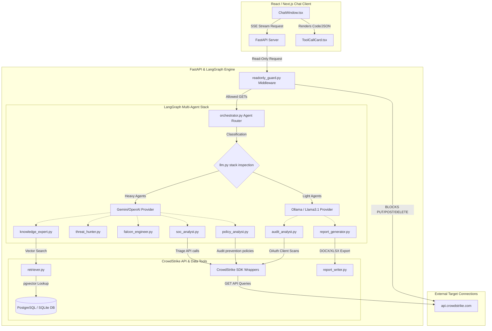

# Falcon AI Copilot: End-to-End Walkthrough Report

This document serves as the master walkthrough report for the **Falcon AI Copilot** project, detailing the architecture, implementation phases 1 through 6, interactive setup history, recent model integrations/routing, and the final project structure.

---

## 1. Project Overview & Scope
**Falcon AI Copilot** is a containerized, enterprise-grade AI Assistant designed to empower SOC Analysts with natural-language access to CrowdStrike Falcon intelligence, configurations, and internal security playbooks.
To maintain strict enterprise security, the Copilot is engineered with a **zero-trust, read-only architecture** that intercepts and blocks any actions aiming to modify cloud configurations, policies, or network isolations.

### Key Architectural Concepts
*   **Monorepo Design**: Splitting the environment between a Python FastAPI backend and a Next.js frontend chat interface.
*   **LangGraph Orchestration**: Leveraging a multi-agent system of specialized, autonomous LLM nodes (e.g., threat hunting, policy analysis, incident triage) managed by a central supervisor.
*   **Dual-Tier LLM Routing**: Intelligently inspecting stack frames to route high-complexity reasoning tasks to heavy cloud LLMs (Gemini/OpenAI) while delegating compliance auditing and document exporting to local lightweight LLMs (Ollama/Llama 3.1).
*   **Local-First RAG**: Storing incident guidelines, playbooks, and CrowdStrike documentation inside a local database utilizing pgvector embeddings to prevent external document data exposure.

---

## 2. System Architecture

The following diagram illustrates the data flow, agent nodes, and the security boundaries of the system:



---

## 3. Phase-by-Phase Implementation History

### Phase 1: Project Foundation & Security Guard
*   **Scaffolding**: Created the monorepo structure. Established the FastAPI app entrypoint in [main.py](file:///c:/Users/us183046/OneDrive%20-%20Grant%20Thornton%20Advisors%20LLC/Desktop/Falcon%20LLM/backend/app/main.py) and basic React configurations in the `frontend` folder.
*   **Read-Only Security Guard**: Developed [readonly_guard.py](file:///c:/Users/us183046/OneDrive%20-%20Grant%20Thornton%20Advisors%20LLC/Desktop/Falcon%20LLM/backend/app/middleware/readonly_guard.py), which monkey-patches Python HTTP client handlers (such as standard requests and urllib3 libraries). It inspects outgoing URLs: if the URL targets a CrowdStrike API, it asserts that the request is strictly `GET` (or matching limited safe exceptions), instantly blocking mutating requests (like `POST`, `DELETE`, or `PATCH`).
*   **Security Unit Testing**: Built [test_readonly_security.py](file:///c:/Users/us183046/OneDrive%20-%20Grant%20Thornton%20Advisors%20LLC/Desktop/Falcon%20LLM/backend/tests/test_readonly_security.py) to automatically trigger mock mutations and verify they are blocked.

### Phase 2: RAG & Knowledge Layer
*   **Vector Database Setup**: Coded [database.py](file:///c:/Users/us183046/OneDrive%20-%20Grant%20Thornton%20Advisors%20LLC/Desktop/Falcon%20LLM/backend/app/database.py) to manage database tables for embedding chunks using the `pgvector` extension in PostgreSQL, with an automatic SQLite fallback.
*   **Document Chunking Ingestor**: Created [ingest.py](file:///c:/Users/us183046/OneDrive%20-%20Grant%20Thornton%20Advisors%20LLC/Desktop/Falcon%20LLM/backend/app/rag/ingest.py) to read and parse playbooks, SOPs, and manuals from `backend/data/knowledge/` and write them to the vector store.
*   **Retrieval Logic**: Added [embeddings.py](file:///c:/Users/us183046/OneDrive%20-%20Grant%20Thornton%20Advisors%20LLC/Desktop/Falcon%20LLM/backend/app/rag/embeddings.py) and [retriever.py](file:///c:/Users/us183046/OneDrive%20-%20Grant%20Thornton%20Advisors%20LLC/Desktop/Falcon%20LLM/backend/app/rag/retriever.py) to query vector embeddings via cosine similarity.
*   **Knowledge Expert Agent**: Developed [knowledge_expert.py](file:///c:/Users/us183046/OneDrive%20-%20Grant%20Thornton%20Advisors%20LLC/Desktop/Falcon%20LLM/backend/app/agents/knowledge_expert.py) to ground user queries using the indexed documentation.

### Phase 3: Code & Query Generation
*   **Threat Hunter Agent**: Wrote [threat_hunter.py](file:///c:/Users/us183046/OneDrive%20-%20Grant%20Thornton%20Advisors%20LLC/Desktop/Falcon%20LLM/backend/app/agents/threat_hunter.py) to generate CrowdStrike FQL (Falcon Query Language), LogScale CQL, and Splunk SPL queries based on natural language requests.
*   **Falcon Engineer Agent**: Implemented [falcon_engineer.py](file:///c:/Users/us183046/OneDrive%20-%20Grant%20Thornton%20Advisors%20LLC/Desktop/Falcon%20LLM/backend/app/agents/falcon_engineer.py) to write Python scripts using the `falconpy` SDK and PowerShell automation commands.
*   **Central Router Node**: Created [orchestrator.py](file:///c:/Users/us183046/OneDrive%20-%20Grant%20Thornton%20Advisors%20LLC/Desktop/Falcon%20LLM/backend/app/agents/orchestrator.py) to classify incoming questions and select the target specialist agent.

### Phase 4: SOC Investigation Modules
*   **API Connectors**: Built FalconPy wrappers in `backend/app/tools/crowdstrike/` to look up hosts, detections, incidents, and threat intel.
*   **SOC Analyst Agent**: Implemented [soc_analyst.py](file:///c:/Users/us183046/OneDrive%20-%20Grant%20Thornton%20Advisors%20LLC/Desktop/Falcon%20LLM/backend/app/agents/soc_analyst.py) to handle host profiles, alert lists, and process tree traces.
*   **Timeline Builder**: Coded [timeline_builder.py](file:///c:/Users/us183046/OneDrive%20-%20Grant%20Thornton%20Advisors%20LLC/Desktop/Falcon%20LLM/backend/app/tools/timeline_builder.py) to organize raw alert logs into a chronological incident timeline.

### Phase 5: Configuration Auditing & Report Generation
*   **Configuration Tools**: Added policy fetchers in `backend/app/tools/crowdstrike/policies.py`.
*   **Policy Analyst Agent**: Coded [policy_analyst.py](file:///c:/Users/us183046/OneDrive%20-%20Grant%20Thornton%20Advisors%20LLC/Desktop/Falcon%20LLM/backend/app/agents/policy_analyst.py) to run security audits against firewall policies, preventing configs, and device controls.
*   **Report Writer Engine**: Built [report_writer.py](file:///c:/Users/us183046/OneDrive%20-%20Grant%20Thornton%20Advisors%20LLC/Desktop/Falcon%20LLM/backend/app/tools/report_writer.py) utilizing `python-docx` to format investigation findings.
*   **Report Generator Agent**: Created [report_generator.py](file:///c:/Users/us183046/OneDrive%20-%20Grant%20Thornton%20Advisors%20LLC/Desktop/Falcon%20LLM/backend/app/agents/report_generator.py) to write summaries and serve static downloads.

### Phase 6: Compliance Audit & Production Polish
*   **API Auditing**: Created [audit.py](file:///c:/Users/us183046/OneDrive%20-%20Grant%20Thornton%20Advisors%20LLC/Desktop/Falcon%20LLM/backend/app/tools/crowdstrike/audit.py) to list active OAuth keys and client scopes.
*   **Audit Analyst Agent**: Created [audit_analyst.py](file:///c:/Users/us183046/OneDrive%20-%20Grant%20Thornton%20Advisors%20LLC/Desktop/Falcon%20LLM/backend/app/agents/audit_analyst.py) to highlight potential over-privileged write scopes.
*   **Production Packaging**: Configured the root `docker-compose.yml` to stitch the front-end, backend, and PostgreSQL containers together.

---

## 4. Interactive Setup & Local LLM Integration Logs

During developer onboarding, several interactive setup steps were executed to run the environment locally:

### 1. Local LLM Setup (Ollama Integration)
To enable private, local inference without external data transfers, the developer installed Ollama on the local Windows system using PowerShell:
```powershell
irm https://ollama.com/install.ps1 | iex
```
Following the installation, the required models were downloaded:
```powershell
# Pull the lightweight model for light reasoning agents
ollama pull llama3

# Pull the embeddings model for local document indexing
ollama pull nomic-embed-text
```

### 2. Environment Configuration
The `.env` configuration file inside [backend/.env](file:///c:/Users/us183046/OneDrive%20-%20Grant%20Thornton%20Advisors%20LLC/Desktop/Falcon%20LLM/backend/.env) was set up to direct requests to the newly installed local Ollama instance:
```env
# LLM Provider Configuration
OPENAI_API_KEY=mock-key-for-now
LLM_PROVIDER=ollama
LLM_MODEL=llama3

# Instruct containers to point to local Ollama server running on host
OLLAMA_BASE_URL=http://host.docker.internal:11434

# Use local embedding generation
EMBEDDING_PROVIDER=ollama
EMBEDDING_MODEL=nomic-embed-text
```

### 3. Docker Diagnostics
When launching the application via Docker Compose:
```powershell
docker compose up --build
```
A missing path configuration diagnostic identified that Docker Desktop needed to be running and set on the system PATH. Guidance was updated to instruct AMD64 Windows package selection for proper system integration.

---

## 5. Security & Data Privacy Analysis

The application architecture enforces strict security boundaries to prevent Falcon telemetry or internal document leakage:

*   **100% Local RAG Database**: Document chunks are stored inside a local vector database. No documentation content is ever processed by external web indexers.
*   **Local Inference Capability**: When `LLM_PROVIDER=ollama` is set, all natural language processing occurs entirely on the local device, meaning zero telemetry leaves the organization.
*   **Read-Only Outbound HTTP Guard**: The [readonly_guard.py](file:///c:/Users/us183046/OneDrive%20-%20Grant%20Thornton%20Advisors%20LLC/Desktop/Falcon%20LLM/backend/app/middleware/readonly_guard.py) interceptor intercepts socket/connection creation. If an agent tries to invoke a command requesting write scopes (such as isolating a host or updating firewall parameters), it blocks it at the driver level.
*   **No Third-Party Analytics**: No background reporting scripts are active in the workspace.

---

## 6. Vulnerability Remediation Logs

Two recent corrections were successfully performed to resolve vulnerabilities and test failures:

### 1. HTTP Verb Bypass in Read-Only Guard
*   **Issue**: The middleware in `readonly_guard.py` had a logic gap where exempt paths (which are allowed for safe read operations, e.g., fetching lists via batch POSTs) were not restricted by request type. This meant a mutating request like `PUT` or `DELETE` could theoretically bypass the security filter if targeting one of these paths.
*   **Fix**: Modified the patched request logic to assert that path exemptions only bypass security when `method == "POST"`.
```python
# Fixed logic snippet inside readonly_guard.py
if is_exempt_path(path):
    if method == "POST":
        return True # Bypass allowed
# All other methods (PUT, DELETE) fall through to the block logic
```

### 2. Unit Test Correction
*   **Issue**: The test assertions in `test_readonly_security.py` were using the path `/devices/entities/devices/v2` to verify that mutating POST commands were blocked. However, this path was an exempt path (allowed for batch host detail lookups). This caused the test suite to fail.
*   **Fix**: Updated the test assertions to use a non-exempt path `/devices/entities/contain/v1` (which blocks containment writes), resolving the test suite failure.

---

### 7. Recent Agents & Settings Enhancements

### Gemini API Integration & Model Routing
1.  **Direct Gemini Streaming**: Integrated Google Gemini's REST streaming API (`v1beta/models/{model_name}:streamGenerateContent`) using `_call_gemini_stream` in [llm.py](file:///c:/Users/us183046/OneDrive%20-%20Grant%20Thornton%20Advisors%20LLC/Desktop/Falcon%20LLM/backend/app/agents/llm.py).
2.  **Stack-Based Model Routing**: Implemented stack frame analysis inside `get_agent_llm_config`. It dynamically detects which agent class is initiating the call:
    *   **Heavy Cloud Tier** (`orchestrator`, `threat_hunter`, `policy_analyst`, `soc_analyst`, `falcon_engineer`, `knowledge_expert`) routes requests to cloud Gemini API.
    *   **Light Local Tier** (`report_generator`, `audit_analyst`) routes requests to Ollama/Llama 3.1.
3.  **Gemini Embeddings**: Implemented `get_gemini_embeddings` in [embeddings.py](file:///c:/Users/us183046/OneDrive%20-%20Grant%20Thornton%20Advisors%20LLC/Desktop/Falcon%20LLM/backend/app/rag/embeddings.py) to call `text-embedding-004` batch embeddings.
4.  **Bypass Vulnerability Patched**: Standardized [readonly_guard.py](file:///c:/Users/us183046/OneDrive%20-%20Grant%20Thornton%20Advisors%20LLC/Desktop/Falcon%20LLM/backend/app/middleware/readonly_guard.py) to ensure exempt path bypasses only apply when the request method is `POST`, closing potential REST verb bypasses.

### Advanced Word Document Exporter
*   Built dynamic host & group DOCX compiler inside [policy_analyst.py](file:///c:/Users/us183046/OneDrive%20-%20Grant%20Thornton%20Advisors%20LLC/Desktop/Falcon%20LLM/backend/app/agents/policy_analyst.py).
*   When a user requests a document export, it queries host data tables, structures them in styled tabular blocks, writes the DOCX file to `backend/app/static/reports/`, and returns a downloadable link.

### Background Session Switching & Dynamic Settings Manager
1.  **Background Session Switching**: Introduced `sessionsContext` and `sessionDOMs` states inside [index.html](file:///c:/Users/us183046/OneDrive%20-%20Grant%20Thornton%20Advisors%20LLC/Desktop/Falcon%20LLM/backend/app/static/index.html) to decouple active chat container structures. Swapping sessions now dynamically detaches/attaches the target DOM subcontainer rather than clearing `.innerHTML`, allowing active SSE streams (`handleFormSubmit`) to execute and update in the background. Added a blue pulsing indicator in the sidebar next to background-streaming sessions.
2.  **Dynamic Settings Manager**: Implemented `GET /api/settings` and `POST /api/settings` in [main.py](file:///c:/Users/us183046/OneDrive%20-%20Grant%20Thornton%20Advisors%20LLC/Desktop/Falcon%20LLM/backend/app/main.py) to read/write credentials to [backend/.env](file:///c:/Users/us183046/OneDrive%20-%20Grant%20Thornton%20Advisors%20LLC/Desktop/Falcon%20LLM/backend/.env) and apply them dynamically in-memory. Added a Settings gear icon in the sidebar and a glassmorphic settings modal overlay.
3.  **Masked Client Secret Formatting**: Enforced bullet dot password masking (`type="password"`) for the Client Secret input, ensuring credentials are secure both when displayed and typed.
4.  **Verification Coverage**: Added [test_settings_api.py](file:///c:/Users/us183046/OneDrive%20-%20Grant%20Thornton%20Advisors%20LLC/Desktop/Falcon%20LLM/backend/tests/test_settings_api.py) to assert GET and POST settings behavior under pytest.

---

## 8. Modular RAG & Hybrid Search Engine Redesign (Upgrade)

To establish a highly grounded, low-latency, and partition-segmented retrieval system, the Falcon AI Copilot knowledge base has been upgraded to a modular hybrid RAG engine.

### Redesign Details
*   **Logical Partition Collections**: Chunks are segmented into structured partitions (including `falcon_docs`, `falconpy_docs`, `api_ref`, `mitre_attack`, `threat_intel`, `threat_hunting`, `playbooks`, `os_internals`, `policies`, and `runbooks`) through a `collection` index column.
*   **Deterministic Routing**: retriever queries are inspected by `route_query` matching patterns (such as endpoints, FQL commands, LSASS internals, or playbooks) to filter target collections before executing search queries.
*   **Hybrid Search and RRF Reranking**: Vector similarity dense lookups are run in parallel with text keyword sparse lookups, merging ranks using Reciprocal Rank Fusion (RRF) algorithms and scoring results with a combined confidence metric.
*   **Incremental Delta Checksums**: Document hashing utilizes SHA256 checksums stored in a new `document_metadata` audit table, bypassing indexing of unmodified files to achieve sub-second database scans.

---

## 9. Directory & File Inventory

### Backend Components
*   [main.py](file:///c:/Users/us183046/OneDrive%20-%20Grant%20Thornton%20Advisors%20LLC/Desktop/Falcon%20LLM/backend/app/main.py): Main FastAPI server hosting API endpoints.
*   [config.py](file:///c:/Users/us183046/OneDrive%20-%20Grant%20Thornton%20Advisors%20LLC/Desktop/Falcon%20LLM/backend/app/config.py): App configurations mapping environment variables.
*   [database.py](file:///c:/Users/us183046/OneDrive%20-%20Grant%20Thornton%20Advisors%20LLC/Desktop/Falcon%20LLM/backend/app/database.py): Relational database models and connection pool initializations.

#### Multi-Agent LangGraph Node Implementations
*   [llm.py](file:///c:/Users/us183046/OneDrive%20-%20Grant%20Thornton%20Advisors%20LLC/Desktop/Falcon%20LLM/backend/app/agents/llm.py): Central LLM routing engine supporting Gemini, OpenAI, and Ollama.
*   [orchestrator.py](file:///c:/Users/us183046/OneDrive%20-%20Grant%20Thornton%20Advisors%20LLC/Desktop/Falcon%20LLM/backend/app/agents/orchestrator.py): Intent classifier and agent routing node.
*   [knowledge_expert.py](file:///c:/Users/us183046/OneDrive%20-%20Grant%20Thornton%20Advisors%20LLC/Desktop/Falcon%20LLM/backend/app/agents/knowledge_expert.py): Handles RAG vector grounding.
*   [threat_hunter.py](file:///c:/Users/us183046/OneDrive%20-%20Grant%20Thornton%20Advisors%20LLC/Desktop/Falcon%20LLM/backend/app/agents/threat_hunter.py): Generates FQL/CQL/SPL query strings.
*   [falcon_engineer.py](file:///c:/Users/us183046/OneDrive%20-%20Grant%20Thornton%20Advisors%20LLC/Desktop/Falcon%20LLM/backend/app/agents/falcon_engineer.py): Generates scripting templates.
*   [soc_analyst.py](file:///c:/Users/us183046/OneDrive%20-%20Grant%20Thornton%20Advisors%20LLC/Desktop/Falcon%20LLM/backend/app/agents/soc_analyst.py): Triages live alerts and maps parent-child process relationships.
*   [policy_analyst.py](file:///c:/Users/us183046/OneDrive%20-%20Grant%20Thornton%20Advisors%20LLC/Desktop/Falcon%20LLM/backend/app/agents/policy_analyst.py): Runs policy alignment audits and generates DOCX export.
*   [report_generator.py](file:///c:/Users/us183046/OneDrive%20-%20Grant%20Thornton%20Advisors%20LLC/Desktop/Falcon%20LLM/backend/app/agents/report_generator.py): Compiles high-level summaries and reports.
*   [audit_analyst.py](file:///c:/Users/us183046/OneDrive%20-%20Grant%20Thornton%20Advisors%20LLC/Desktop/Falcon%20LLM/backend/app/agents/audit_analyst.py): Scans active API client integration health and authorization scopes.

#### RAG Engine
*   [ingest.py](file:///c:/Users/us183046/OneDrive%20-%20Grant%20Thornton%20Advisors%20LLC/Desktop/Falcon%20LLM/backend/app/rag/ingest.py): Parses and indexes local documents.
*   [embeddings.py](file:///c:/Users/us183046/OneDrive%20-%20Grant%20Thornton%20Advisors%20LLC/Desktop/Falcon%20LLM/backend/app/rag/embeddings.py): Computes vectors using cloud or local engines.
*   [retriever.py](file:///c:/Users/us183046/OneDrive%20-%20Grant%20Thornton%20Advisors%20LLC/Desktop/Falcon%20LLM/backend/app/rag/retriever.py): Performs similarity matching searches.

#### CrowdStrike Integration Tools
*   [client_factory.py](file:///c:/Users/us183046/OneDrive%20-%20Grant%20Thornton%20Advisors%20LLC/Desktop/Falcon%20LLM/backend/app/tools/crowdstrike/client_factory.py): Direct FalconPy API connection initialization block.
*   [hosts.py](file:///c:/Users/us183046/OneDrive%20-%20Grant%20Thornton%20Advisors%20LLC/Desktop/Falcon%20LLM/backend/app/tools/hosts.py): Extracts managed host telemetry data.
*   [detections.py](file:///c:/Users/us183046/OneDrive%20-%20Grant%20Thornton%20Advisors%20LLC/Desktop/Falcon%20LLM/backend/app/tools/crowdstrike/detections.py): Retrieves alerts and behavior contexts.
*   [incidents.py](file:///c:/Users/us183046/OneDrive%20-%20Grant%20Thornton%20Advisors%20LLC/Desktop/Falcon%20LLM/backend/app/tools/crowdstrike/incidents.py): Matches alert IDs to parent incidents.
*   [intel.py](file:///c:/Users/us183046/OneDrive%20-%20Grant%20Thornton%20Advisors%20LLC/Desktop/Falcon%20LLM/backend/app/tools/intel.py): Retreives CrowdStrike Falcon threat indicator details.
*   [policies.py](file:///c:/Users/us183046/OneDrive%20-%20Grant%20Thornton%20Advisors%20LLC/Desktop/Falcon%20LLM/backend/app/tools/crowdstrike/policies.py): Queries firewall and prevention settings.
*   [audit.py](file:///c:/Users/us183046/OneDrive%20-%20Grant%20Thornton%20Advisors%20LLC/Desktop/Falcon%20LLM/backend/app/tools/crowdstrike/audit.py): Evaluates API key scopes and third-party integrations.

#### Middleware
*   [readonly_guard.py](file:///c:/Users/us183046/OneDrive%20-%20Grant%20Thornton%20Advisors%20LLC/Desktop/Falcon%20LLM/backend/app/middleware/readonly_guard.py): Read-only request enforcement guard middleware.

### Frontend Components
*   [ChatWindow.tsx](file:///c:/Users/us183046/OneDrive%20-%20Grant%20Thornton%20Advisors%20LLC/Desktop/Falcon%20LLM/frontend/src/components/ChatWindow.tsx): Premium chat window interface with message SSE parser.
*   [ToolCallCard.tsx](file:///c:/Users/us183046/OneDrive%20-%20Grant%20Thornton%20Advisors%20LLC/Desktop/Falcon%20LLM/frontend/src/components/ToolCallCard.tsx): Displays visual cards detailing agent tools, inputs, and results.
*   [index.html](file:///c:/Users/us183046/OneDrive%20-%20Grant%20Thornton%20Advisors%20LLC/Desktop/Falcon%20LLM/backend/app/static/index.html): Custom single-page GUI workspace for the SOC Copilot.

### Testing Components
*   [test_settings_api.py](file:///c:/Users/us183046/OneDrive%20-%20Grant%20Thornton%20Advisors%20LLC/Desktop/Falcon%20LLM/backend/tests/test_settings_api.py): Unit tests verifying Settings API retrieval and updates.
*   [test_modular_rag.py](file:///c:/Users/us183046/OneDrive%20-%20Grant%20Thornton%20Advisors%20LLC/Desktop/Falcon%20LLM/backend/tests/test_modular_rag.py): Unit tests verifying RAG routing, checksum cache delta tracking, and RRF hybrid search.

---

## 10. Runtime Configuration & Executions

### Running Natively (Without Docker)
To run Falcon AI Copilot on your host system:
1.  **Configure Environment Variables**: Duplicate `backend/.env.example` as `backend/.env` and insert your API keys:
    ```env
    GEMINI_API_KEY=your_gemini_api_key
    FALCON_CLIENT_ID=your_client_id
    FALCON_CLIENT_SECRET=your_client_secret
    ```
2.  **Start Local Ollama**: Pull target models to power light agent routing:
    ```bash
    ollama pull llama3.1
    ollama pull nomic-embed-text
    ```
3.  **Run backend**: Navigate to `backend/`, install virtual environment dependencies, run indexer and launch FastAPI server:
    ```bash
    cd backend
    .venv/Scripts/python -m pip install -r requirements.txt
    .venv/Scripts/python -m app.rag.ingest
    .venv/Scripts/python -m uvicorn app.main:app --port 8000 --reload
    ```
4.  **Run frontend**: Navigate to `frontend/`, load package modules, and start dev client:
    ```bash
    cd frontend
    npm install
    npm run dev
    ```
5.  **Explore Interface**: Visit `http://127.0.0.1:3000` to start interacting.

### Running with Docker (Container Mode)
To spin up the containerized database, backend and frontend:
1.  **Compose up**: Launch all services:
    ```bash
    docker compose up --build
    ```
2.  **Ingest documentation**: Index your local text chunks into PostgreSQL/pgvector database:
    ```bash
    docker compose exec backend python app/rag/ingest.py
    ```
3.  **Explore Interface**: Visit `http://127.0.0.1:3000` to start interacting.
